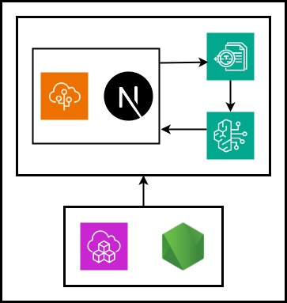

# Bedrock Document Extractor

Extracts structured data from PDFs using Amazon Bedrock + Textract via a Next.js web app deployed to Elastic Beanstalk.

[](resources/architecture.jpg)

## Features

- Upload PDF (≤1MB, ≤5 pages)
- Configure custom fields to extract (date, name, amount...)
- Amazon Bedrock LLM → Textract prompts → JSON extraction
- S3 temp storage + cleanup

## Quick Start (Local Dev)

1. **Copy config:**
   ```
   cp scripts/aws-config.yaml.example scripts/aws-config.yaml  # ← edit YOUR AWS keys
   ```

2. **Local Next.js:**
   ```
   cd app/web
   npm install
   npm run dev
   ```
   Open [http://localhost:3000](http://localhost:3000)

## Deploy to AWS

**Prerequisites:**
- AWS CLI + IAM user keys in `scripts/aws-config.yaml`
- yq (`sudo snap install yq`)
- Node.js, zip

1. **Deploy:**
   ```
   ./scripts/deploy.sh
   ```
   → Creates CDK stack + EB environment → outputs **Application URL**.

2. **Status:**
   ```
   ./scripts/status.sh
   ```
   → CF stacks, EB health, app URL + HTTP status.

3. **Update:**
   ```
   ./scripts/deploy.sh
   ```
   → Rebuilds Next.js → new EB version.

4. **Destroy:**
   ```
   ./scripts/destroy.sh
   ```
   → Terminates EB + deletes CF stack (S3 auto-delete).

## Stack Structure

```
CDK Stack: BedrockDocExtractStack
├── S3: temp-pdfs-xxx (PDF upload storage, 1d lifecycle)
├── Lambda: extraction-server (Bedrock+Textract)
├── EB: BedrockDocExtract (Next.js API → Lambda)
└── Logs: CloudWatch
```

**EB:** Node.js 24 on Amazon Linux 2023 v6.10.1

## Config

**`scripts/aws-config.yaml`:**
```yaml
aws:
  region: eu-central-1
  access_key_id: AKIA...
  secret_access_key: ...
  default_region: eu-central-1

cdk:
  stack_name: BedrockDocExtractStack

bedrock:
  model_id: anthropic.claude-3-sonnet-20240229-v1:0

elastic_beanstalk:
  app_name: BedrockDocExtract
  env_name: BedrockDocExtract-env
  solution_stack: Node.js 24 AL2023 version 6.10.1
```

## Test Data

Regenerate:
```
./scripts/generatetestdata.sh
```
Fixtures in `fixtures/generated/*.pdf` (git tracked).

## Troubleshooting

**EB 502:** `./scripts/status.sh` → check health/logs.
**Extraction fail:** CloudWatch Logs → Lambda `extraction-server`.
**Deploy fail:** CDK synth → `cd infra/cdk && npx cdk synth`.

**Test local:** `npm run dev` → `/api/extract` POST.

## Original Task

Extract Bedrock docs → structured fields from claim letters.
